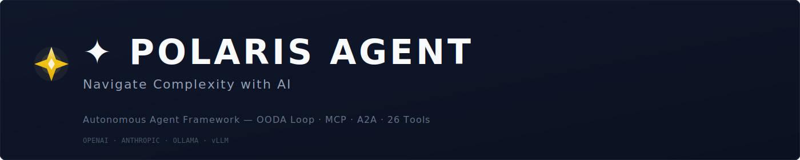

<div align="center">
  
  <p>
    
    
    
    
    
  </p>
</div>

---

## What is Polaris?

Polaris (北极星) is a complete agent framework that works out of the box. Named after the North Star — the one fixed point navigators have relied on for millennia — Polaris is your constant AI companion through complexity.

**Three ways to use it:**

```bash
polaris "summarize this codebase"       # Single-shot — one answer, done
echo "..." | polaris                    # Pipe — works in scripts
polaris                                 # Interactive REPL — full conversation
```

---

## Quick Start

```bash
# 1. Install (pick one)
npm install -g polaris-agent     # npm (recommended)
pip install polaris-agent        # PyPI
pipx install polaris-agent       # pipx (isolated)

# 2. Configure (interactive — 30 seconds)
polaris init

# 3. Go
polaris "Hello! What can you do?"
```

### More install options

```bash
# Docker
docker run -p 8000:8000 -e OPENAI_API_KEY=sk-... ghcr.io/zbcxy/polaris-agent:latest
docker compose up -d

# One-command curl
curl -sSL https://raw.githubusercontent.com/ZBcxy/polaris-agent/main/install.py | python3
```

### Zero config with Ollama

```bash
ollama pull qwen3:8b
polaris          # ✦ Auto-detected Ollama! Model: qwen3:8b
```

---

## Lifecycle

```
┌─ Install ───────────────────────────────────────────────┐
│  pip install polaris-agent                               │
│  polaris init          ← Interactive setup wizard        │
│  polaris login         ← Save API keys                   │
└─────────────────────────────────────────────────────────┘
                          │
┌─ Everyday use ──────────────────────────────────────────┐
│  polaris "fix this bug"        Single-shot               │
│  cat log.txt | polaris         Pipe / stdin              │
│  polaris                       Interactive REPL          │
│  polaris exec task.txt         Execute task file         │
│  polaris --model gpt-4o        Override model            │
│  polaris --approval-mode L2    Override autonomy         │
└─────────────────────────────────────────────────────────┘
                          │
┌─ Manage ────────────────────────────────────────────────┐
│  polaris config               Show all config            │
│  polaris config set KEY VAL   Change a setting           │
│  polaris profiles use work    Switch profile             │
│  polaris sessions resume ...   Continue a conversation   │
│  polaris mcp add NAME CMD     Add an MCP server          │
│  polaris doctor               Diagnose issues            │
│  polaris update               Self-update                │
│  polaris logout               Remove credentials         │
└─────────────────────────────────────────────────────────┘
```

---

## Commands

### Run

| Command | Description |
|---------|-------------|
| `polaris "prompt"` | Single-shot, non-interactive |
| `echo "..." \| polaris` | Pipe / stdin mode |
| `polaris` | Interactive REPL with session history |
| `polaris exec <file>` | Execute a task file |
| `polaris --model <name>` | Override model for this session |
| `polaris --approval-mode L0-L4` | Override autonomy level |

### Setup & Auth

| Command | Description |
|---------|-------------|
| `polaris init` | Interactive setup wizard (LLM → Model → Autonomy → Save) |
| `polaris login` | Securely save API keys to config |
| `polaris logout` | Remove stored credentials |
| `polaris doctor` | Environment diagnostics |

### Config

| Command | Description |
|---------|-------------|
| `polaris config` | Show all configuration with categories |
| `polaris config get <key>` | Get a single value |
| `polaris config set <key> <val>` | Set and persist a value |
| `polaris config unset <key>` | Revert to default |
| `polaris config reset` | Reset all to defaults |
| `polaris config path` | Show config file path (`~/.polaris/config.json`) |
| `polaris config export --profile <name>` | Export current config as a named profile |

### Profiles

| Command | Description |
|---------|-------------|
| `polaris profiles list` | List named profiles |
| `polaris profiles use <name>` | Switch to a profile |

### Sessions

| Command | Description |
|---------|-------------|
| `polaris sessions list` | List recent sessions |
| `polaris sessions resume <id>` | Resume a conversation |

### MCP

| Command | Description |
|---------|-------------|
| `polaris mcp add <name> "<cmd>"` | Register an MCP server |
| `polaris mcp list` | List registered servers |
| `polaris mcp remove <name>` | Remove a server |

### Maintenance

| Command | Description |
|---------|-------------|
| `polaris update` | Self-update via pip |
| `polaris doctor` | Full environment diagnostics |
| `polaris --logo [--style ...]` | Display brand logo |
| `polaris --version` | Version info |

### Install / Uninstall

| Command | Description |
|---------|-------------|
| `npm install -g polaris-agent` | npm global install (recommended) |
| `npm uninstall -g polaris-agent` | npm uninstall (cleanup everything) |
| `pip install polaris-agent` | PyPI install |
| `pip uninstall polaris-agent` | PyPI uninstall |
| `pipx install polaris-agent` | pipx isolated install |
| `python install.py` | One-command curl install |
| `python install.py --uninstall` | Full uninstall |
| `python install.py --verify` | Verify installation |
| `python install.py --doctor` | Environment diagnostics |

---

## REPL Commands

Inside the interactive REPL:

| Command | Description |
|---------|-------------|
| `exit`, `quit`, `q` | Exit (session auto-saved) |
| `help` | Show help |
| `/help` | Show slash commands |
| `/config` | Show configuration |
| `/model gpt-4o` | Change model |
| `/autonomy L2` | Change autonomy level |
| `/doctor` | Run diagnostics |
| `/sessions` | List sessions |
| `version` | Show version |
| `clear` | Clear screen |
| `config` | Show configuration |

---

## Autonomy Levels

| Level | Name | Behavior |
|-------|------|----------|
| L0 | Manual | Suggests only, never acts |
| L1 | Assisted | Acts after explicit confirmation |
| L2 | Supervised | Acts autonomously, reports |
| L3 | Autonomous | Acts within policy bounds |
| L4 | Full | Complete authority |

---

## Configuration

Config priority (like Claude Code's `settings.json`):

```
CLI flags > env vars > .polaris/config.local.json > .polaris/config.json > ~/.polaris/config.json > defaults
    ↑                        ↑                          ↑                      ↑
  session              project-local              project (committed)       global
                       (gitignored)
```

Three config files, three scopes:

| File | Scope | Git | Use |
|------|-------|-----|-----|
| `~/.polaris/config.json` | Global | — | API keys, default model, personal settings |
| `.polaris/config.json` | Project | Commit | Team model choice, project env vars |
| `.polaris/config.local.json` | Project | Ignore | Personal overrides per project |

`polaris config` shows which layer provides each value (GLB/PRJ/LOC/DEF).
`polaris config set KEY VAL --project` writes to the project layer.

### Key variables

| Variable | Default | Description |
|----------|---------|-------------|
| `LLM_MODEL` | `gpt-4o` | Model name |
| `LLM_PROVIDER` | `openai` | openai / anthropic |
| `OPENAI_API_KEY` | — | OpenAI API key |
| `ANTHROPIC_API_KEY` | — | Anthropic API key |
| `POLARIS_AUTONOMY` | `L2` | Autonomy level |
| `POLARIS_MAX_STEPS` | `20` | Max OODA iterations |
| `LOCAL_LLM_PROVIDER` | — | ollama / openai_compatible |
| `LOCAL_LLM_MODEL` | — | Local model name |
| `SERVER_PORT` | `8000` | Gateway port |
| `EMBEDDING_PROVIDER` | `openai` | Embedding backend |

---

## Architecture

```
┌────────────────────────────────────────────────────────────────┐
│                       ✦ Polaris Agent                          │
├────────────────────────────────────────────────────────────────┤
│  CLI (polaris)     │  Gateway (FastAPI)  │  SDK (Python)       │
├────────────────────────────────────────────────────────────────┤
│  ┌──────────┐  ┌──────────┐  ┌──────────────────────────────┐  │
│  │ Planner  │  │ Executor │  │        Multi-Agent            │  │
│  │ OODA +   │  │ DAG +    │  │ Blackboard + Coordinator      │  │
│  │ LLM      │  │ Retry    │  │                               │  │
│  └──────────┘  └──────────┘  └──────────────────────────────┘  │
│  ┌──────────┐  ┌──────────┐  ┌──────────────────────────────┐  │
│  │ Memory   │  │ Align    │  │         26 Tools              │  │
│  │ Working  │  │ Guard +  │  │ file / web / code / data /    │  │
│  │ Semantic │  │ Policy   │  │ system                        │  │
│  │ Episodic │  │ Engine   │  │                               │  │
│  └──────────┘  └──────────┘  └──────────────────────────────┘  │
├────────────────────────────────────────────────────────────────┤
│  Protocols:  MCP Server/Client  │  A2A Server/Client           │
└────────────────────────────────────────────────────────────────┘
```

---

## Protocols

### MCP (Model Context Protocol)

Polaris is both an **MCP Server** and **MCP Client**.

**As Server** — expose 26 tools to any MCP-compatible client:

```json
{
  "mcpServers": {
    "polaris": {
      "command": "python",
      "args": ["-m", "mcp.server", "--stdio"]
    }
  }
}
```

**As Client** — consume external MCP tools:

```bash
polaris mcp add filesystem "npx -y @modelcontextprotocol/server-filesystem ."
```

```python
from mcp import MCPClient
client = MCPClient()
await client.connect_stdio("filesystem", "npx", ["-y", "@modelcontextprotocol/server-filesystem", "."])
result = await client.call_tool("read_file", {"path": "/tmp/data.txt"})
```

### A2A (Agent-to-Agent Protocol)

```python
from protocols.a2a import A2AServer, AgentCard

card = AgentCard(
    name="Polaris Agent",
    description="Navigate Complexity with AI — Autonomous Agent Framework",
    url="https://my-polaris.example.com",
)
server = A2AServer(agent_card=card, tool_registry=registry)
```

---

## SDK

```python
# Synchronous
from sdk.client import PolarisClient, Message

with PolarisClient("http://localhost:8000") as client:
    response = client.chat([
        Message(role="user", content="Analyze Q3 sales data")
    ])
    print(response.choices[0].message.content)

# Asynchronous
from sdk.client import AsyncPolarisClient

async with AsyncPolarisClient() as client:
    async for chunk in client.chat_stream(messages):
        print(chunk)
```

---

## Agent API

```python
from core.agent import LLMAgent
from core.planner.llm_planner import LLMPlannerConfig

agent = LLMAgent(config=LLMPlannerConfig(
    model="gpt-4o", provider="openai", api_key="sk-...",
))
result = asyncio.run(agent.run("Create a report from /tmp/sales.csv"))

# Streaming
async for event in agent.run_stream("Analyze the logs"):
    print(event)
```

---

## Tools (26 built-in)

| Category | Count | Tools |
|----------|:-----:|-------|
| File | 9 | read, write, list, delete, search, info, move, copy, mkdir |
| Web | 4 | search, fetch, http_request, url_encode |
| Code | 4 | python_exec, code_analyze, json_format, regex_test |
| Data | 4 | text_process, csv_parse, calc, data_transform |
| System | 5 | system_info, shell_exec, env_var, time_now, disk_usage |

---

## Local Models

| Backend | Setup | Models |
|---------|-------|--------|
| Ollama | `ollama pull qwen3:8b` | qwen3, llama3.1, mistral, deepseek-r1 |
| vLLM | `vllm serve ...` | Any HF model |
| llama.cpp | `llama-server ...` | GGUF format |

Polaris auto-detects running Ollama instances on first launch.

---

## Project Structure

```
.
├── assets/                  # Logo SVG
├── core/                    # Engine: planner, executor, memory, align
│   ├── config_manager.py    #   Config system (JSON, auto-discovery)
│   └── logo.py              #   Terminal brand identity (3 styles)
├── gateway/                 # FastAPI REST API
├── tools/                   # 26 executable tools + registry
├── mcp/                     # MCP Server & Client
├── protocols/a2a/           # A2A Server & Client
├── multi_agent/             # Blackboard + Coordinator
├── sdk/                     # Python SDK (sync + async)
├── cli/                     # CLI interface
│   ├── polaris_cli.py       #   Full lifecycle CLI
│   └── init_wizard.py       #   Interactive setup wizard
├── tests/                   # 139 tests
├── install.py               # One-command lifecycle manager
├── Dockerfile
└── docker-compose.yml
```

---

## vs. Other Frameworks

| Feature | Polaris | LangGraph | CrewAI | AutoGPT | Claude Code |
|---------|:-------:|:---------:|:------:|:-------:|:-----------:|
| OODA Loop | ✅ | ❌ | ❌ | ❌ | ❌ |
| Single-shot mode | ✅ | — | — | ❌ | ✅ |
| Pipe/stdin mode | ✅ | — | — | ❌ | ✅ |
| Session management | ✅ | ✅ | ❌ | ❌ | ✅ |
| Self-update | ✅ | ❌ | ❌ | ❌ | ✅ |
| Interactive REPL | ✅ | ❌ | ❌ | ❌ | ✅ |
| Config profiles | ✅ | ❌ | ❌ | ❌ | ❌ |
| MCP Server + Client | ✅ | ❌ | ❌ | ❌ | ✅ |
| A2A Protocol | ✅ | ❌ | ❌ | ❌ | ❌ |
| Blackboard | ✅ | ❌ | ❌ | ❌ | ❌ |
| Alignment Guard | ✅ | ❌ | ❌ | ❌ | ✅ |
| Docker | ✅ | ✅ | ✅ | ✅ | ✅ |
| 26 Tools | ✅ | ✅ | ✅ | ✅ | ✅ |

---

## Development

```bash
git clone git@github.com:ZBcxy/polaris-agent.git
cd polaris-agent
python -m venv venv && source venv/bin/activate
pip install -e ".[dev]"
pytest tests/ -v
```

---

## License

Apache 2.0 © Polaris Team
